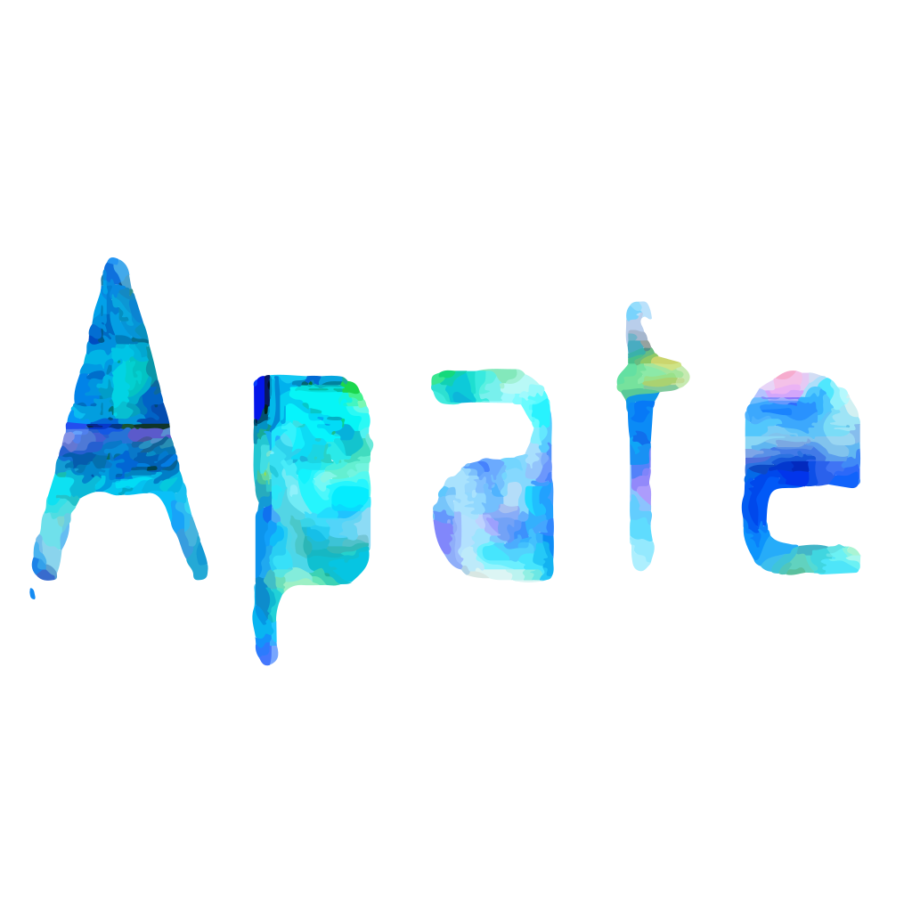

<h1 style="text-align: center">
	 
	
</h1>
<h4 style="text-align: center">Hide your secret Discord messages in other messages!</h4>

Apate is a tool based on [StegCloak](https://github.com/KuroLabs/stegcloak) that allows you to send and read invisible hidden messages through [BetterDiscord](https://betterdiscord.app/). It hides the message using zero width unicode characters and a indicator character at the start of the string. It then goes through all the messages in chat and tries to insert a new `div` with the hidden message.

## Installing
Just download the [Apate.plugin.js](https://github.com/TheGreenPig/Apate/blob/main/Apate.plugin.js) file and pull it into your plugins Folder. Make sure that the plugin is turned on in the settings and that you installed any Libraries, if prompted.

## Usage

Syntax:
>Cover text \*hidden message*

Click the key button or press <kbd>Ctrl</kbd> + <kbd>Enter</kbd> to send the message.

**Note:**

 - The hidden message should turn *italic* if you did it right
 - The cover text must have at least two words for stegcloak to be able to hide text
 - There can't be a string after the hidden message. The second `*` should be the last character

## Authors

</img>
><a href="https://github.com/BenjaminAster">
BenjaminAster
</a>
><a href="https://github.com/TheGreenPig">
TheGreenPig
</a>

